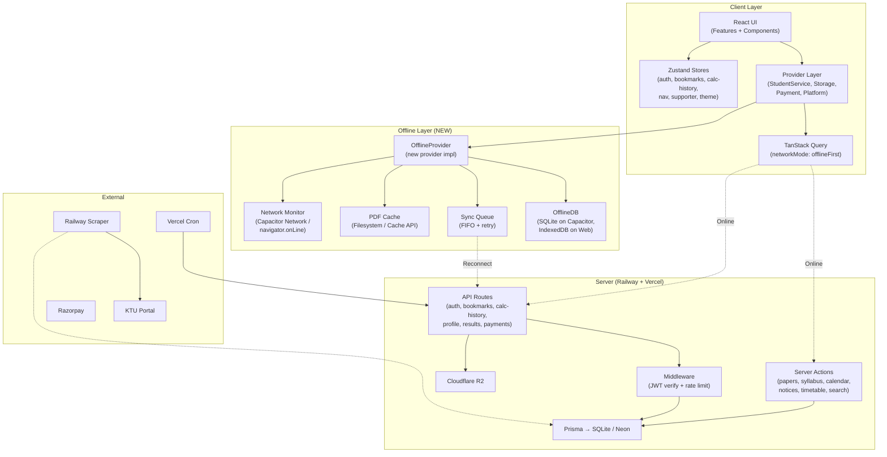
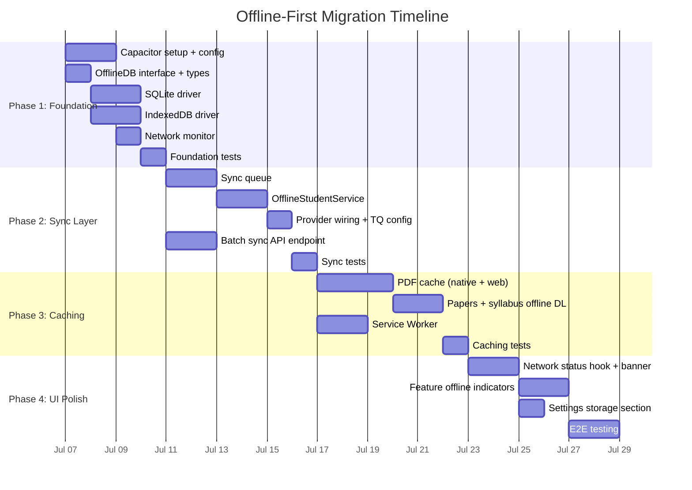

# Offline-First Architecture for KTU One

A production-grade plan to make KTU One work without a network connection on mobile (Capacitor) and degrade gracefully on web, while keeping the Railway scraper → Neon/SQLite → R2 pipeline online-only.

---

## Current State Summary

| Layer | Technology | Current Offline Support |
|---|---|---|
| Frontend | Next.js 16 + React 19 + Zustand + TanStack Query | ❌ None |
| API | Next.js API routes + Server Actions | ❌ All require network |
| Database | Prisma → SQLite (packaged in build) + Neon PostgreSQL (pooled) | ❌ Server-side only |
| File Storage | Cloudflare R2 (PDFs via presigned URLs) | ❌ Presigned URLs require network |
| Auth | Cookie-based JWT (httpOnly) with refresh token rotation | 🟡 Cookies persist across sessions |
| State | 6 Zustand stores (3 persisted to localStorage) | 🟡 Bookmarks, calc-history, theme, supporter persisted |
| Scraper | External Express backend on Railway | ❌ Server-side only |
| Payments | Razorpay (integrated) | ❌ Must be online |
| Cron | Vercel Cron → `/api/cron/sync-notifications` every 15m | ❌ Server-side only |
| Rate Limiting | Upstash Redis (login: 5/15m, refresh: 30/h) | ❌ Server-side only |

### Existing Patterns We Can Leverage

> [!TIP]
> The codebase already has **three patterns** that make offline-first easier to implement:
>
> 1. **Provider abstraction** — `StudentService`, `PaymentProvider`, `StorageProvider`, `PlatformProvider` interfaces with mock + real implementations. We can create `OfflineStudentService` and `OfflineStorageProvider`.
> 2. **Dual-mode data** — Bookmarks and calc-history already switch between DB (authenticated) and Zustand/localStorage (anonymous). We extend this to "DB → local cache → Zustand fallback."
> 3. **Server Actions** — Features like papers, syllabus, calendar, and notices use Server Actions (`actions.ts` files). These can be wrapped with cache-first logic at the hook level.

---

## User Review Required

> [!IMPORTANT]
> **Capacitor + Static Export** — The current build is `output: "standalone"` for server deployment with Caddy. Capacitor wraps a WebView pointing at local files, requiring `output: "export"` (static HTML). This means **Server Actions and API routes won't work in the Capacitor build** — all data fetching must go through client-side `fetch()` to the remote server, falling back to local cache when offline. This is a fundamental architecture split:
>
> - **Web build** (`standalone`): Server Actions + API routes + SSR, Service Worker for offline
> - **Capacitor build** (`export`): Client-side only, SQLite + Filesystem for offline, remote API for online
>
> The existing provider pattern makes this manageable — `HttpStudentService` already uses `fetch()` for the Capacitor path.

> [!IMPORTANT]
> **PDF Offline Strategy** — Caching *all* PDFs would consume 100s of MB. Proposed: cache only **explicitly downloaded/viewed PDFs** with a 200MB LRU quota. Should we also offer a "Download semester pack" for bulk offline?

> [!WARNING]
> **SQLite in Production** — The current production build packages SQLite (`db/custom.db`) alongside Neon PostgreSQL. For Capacitor offline, we'd use a **separate client-side SQLite** (via `@capacitor-community/sqlite`) that mirrors server data — not the production SQLite. The two must not be confused.

---

## Open Questions

1. **Conflict resolution** — When a student saves bookmarks/calc-history offline and the server has different data, use "last-write-wins" or show a conflict UI? *Recommendation: last-write-wins with timestamp, since data is per-student and single-device.*

2. **Offline data freshness** — How stale can notices/calendar be before showing a warning? *Recommendation: subtle "Last updated X ago" badge when data is >24h old.*

3. **Storage quota** — Max cache size for PDFs on mobile? *Recommendation: 200MB with LRU eviction.*

4. **Background sync** — Sync in background on reconnect, or only on user action? *Recommendation: background sync via Capacitor Background Task plugin.*

5. **Auth offline** — JWT access tokens expire in 1h. Refresh tokens in 30d. Offline users can't refresh. *Recommendation: accept expired access tokens for local-only reads (display cached data), but require re-login for any sync operation on reconnect.*

---

## Data Classification: Offline vs. Online

### ✅ Can Work Fully Offline

| Data / Feature | Why | Offline Strategy | Storage |
|---|---|---|---|
| **SGPA/CGPA/Attendance/Internal/Pass Calculators** | Pure computation via `src/lib/utils/calc.ts` | No server needed. Subject data in `src/data/mock-data.ts` + `src/lib/constants` is static. | In-memory |
| **Calculator History** (anon) | Already in Zustand `calc-history-store` | `useCalcHistoryStore` with localStorage persistence already works offline | localStorage (`ktu_one:calc-history`) |
| **Bookmarks** (anon) | Already in Zustand `bookmark-store` | `useBookmarkStore` with localStorage persistence already works offline | localStorage (`ktu_one:bookmarks`) |
| **Theme / Settings** | Client-side `theme-store` + `next-themes` | Already offline | localStorage (`ktu_one:theme`) |
| **Navigation / Search** (UI) | Zustand `nav-store`, client-side routing | Already offline | Memory |
| **Static Reference Data** | `BRANCHES`, `SEMESTERS`, `GRADE_OPTIONS`, `SUBJECTS` | Bundled in JS, no network | JS bundle |
| **Supporter Badge** (display) | `supporter-store` persisted | Badge display works offline (purchase requires online) | localStorage (`ktu_one:supporter`) |

### 🟡 Works Offline with Cached Data (Read-Only)

| Data / Feature | Online Source | Offline Strategy | Freshness |
|---|---|---|---|
| **KTU Notices** (6 categories) | Server Action `getNotices()` / `GET /api/v1/admin/notices` | Cache in local SQLite/IDB. Show cached, refresh on reconnect. | Stale >12h |
| **Calendar Events** (7 types) | Server Action `getCalendarEvents()` | Cache in local SQLite/IDB. | Stale >24h |
| **Question Papers** (list + metadata) | Server Action `getPapers()` | Cache paper metadata locally. Filter/search works offline. | Stale >7d |
| **Syllabus** (list + metadata) | Server Action `getSyllabus()` | Cache syllabus metadata locally. | Stale >30d |
| **Exam Timetables** | Server Action `getActiveTimetable()` | Cache active timetable + entries locally. | Stale >24h |
| **Downloaded PDFs** | R2 presigned URL redirect | Cache in Capacitor Filesystem / Cache API after first download. | Never stale (immutable) |
| **Student Profile** | `GET /api/v1/profile` (from `CachedStudentData`) | Cache locally. Display cached profile offline. | Stale after 24h (matches server cache TTL) |
| **Semester Results** | `GET /api/v1/results` | Cache locally. Display cached results offline. | Stale after 24h |
| **CGPA** | `GET /api/v1/cgpa` | Cache locally. | Stale after 24h |
| **Calculator History** (auth) | `GET /api/v1/calc-history` | Cache in local DB. Sync on reconnect. | Stale until sync |
| **Bookmarks** (auth) | `GET /api/v1/bookmarks` | Cache in local DB. Sync on reconnect. | Stale until sync |
| **Dashboard Stats** | Server Action `getDashboardStats()` | Cache last-fetched stats. | Stale >1h |

### ❌ Must Stay Online

| Data / Feature | Reason |
|---|---|
| **Login** (fresh) | Requires scraper to validate credentials against KTU portal. *But*: existing cookies work offline for cached reads. |
| **Token Refresh** | Requires server-side JWT + DB refresh token validation. |
| **KTU Result Fetching** (fresh) | Proxies to external KTU scraper. Cannot be cached reliably (results change on exam days). |
| **Admin Panel** (all CRUD) | Requires ADMIN_API_KEY auth + server DB/R2 writes. Admin is always online. |
| **PDF Upload** (admin) | Requires R2 upload (max 20MB). |
| **Razorpay Payments** | Payment gateway requires live network. |
| **Cron Notification Sync** | Server-side Vercel Cron. No client involvement. |
| **Rate Limiting** | Upstash Redis is server-side. |
| **User Registration** | Would need scraper + DB (no registration form exists currently — login IS registration via scraper). |

---

## Proposed Architecture

### Architecture Diagram



---

## Proposed Changes

### Component 1: Local Database Layer

An abstraction over SQLite (native) and IndexedDB (web) that caches server data locally.

#### [NEW] `src/lib/offline/types.ts`

Cached entity types mirroring the 16 Prisma models that are relevant offline:

```typescript
// Every cached entity gets sync metadata
interface SyncMeta {
  _cachedAt: number          // when cached locally
  _syncStatus: 'synced' | 'pending' | 'conflict'
  _localVersion: number      // monotonic counter for conflict detection
  _serverUpdatedAt?: string  // last known server timestamp
}

// Cached versions of Prisma models
type CachedNotice = KTUNotice & SyncMeta
type CachedCalendarEvent = CalendarEvent & SyncMeta
type CachedPaper = QuestionPaper & SyncMeta      // metadata only, not PDF
type CachedSyllabus = Syllabus & SyncMeta         // metadata only
type CachedTimetable = ExamTimetable & { entries: ExamTimetableEntry[] } & SyncMeta
type CachedBookmark = Bookmark & SyncMeta
type CachedCalcHistory = CalculatorHistoryEntry & SyncMeta
type CachedProfile = StudentProfile & SyncMeta
type CachedResults = { results: SemesterResult[], cgpa: CGPAResult } & SyncMeta
```

#### [NEW] `src/lib/offline/db.ts`

Platform-agnostic database interface:

```typescript
interface OfflineDB {
  // Read-only cached data (server → local)
  notices: CacheStore<CachedNotice>
  calendar: CacheStore<CachedCalendarEvent>
  papers: CacheStore<CachedPaper>
  syllabus: CacheStore<CachedSyllabus>
  timetables: CacheStore<CachedTimetable>
  profile: CacheStore<CachedProfile>       // single-record
  results: CacheStore<CachedResults>       // single-record

  // Read-write synced data (local ↔ server)
  bookmarks: SyncStore<CachedBookmark>
  calcHistory: SyncStore<CachedCalcHistory>

  // Sync queue
  syncQueue: SyncQueueStore

  // Metadata
  getLastSync(entity: string): Promise<number | null>
  setLastSync(entity: string, timestamp: number): Promise<void>
}

interface CacheStore<T> {
  getAll(filter?: Record<string, unknown>): Promise<T[]>
  upsertMany(items: T[]): Promise<void>
  clear(): Promise<void>
}

interface SyncStore<T> extends CacheStore<T> {
  upsert(item: T): Promise<void>
  delete(id: string): Promise<void>
  getPending(): Promise<T[]>   // items with _syncStatus === 'pending'
}
```

#### [NEW] `src/lib/offline/sqlite-driver.ts`

Capacitor SQLite implementation using `@capacitor-community/sqlite`. Table DDL mirrors the cached types. Uses WAL mode for concurrent reads.

#### [NEW] `src/lib/offline/idb-driver.ts`

Web fallback using `idb` (IndexedDB wrapper). Object stores with indices matching filter patterns (e.g., papers by `[branchCode, semester]`).

---

### Component 2: Sync Queue & Conflict Resolution

#### [NEW] `src/lib/offline/sync-queue.ts`

Manages offline mutations for bookmarks and calculator history:

```typescript
interface SyncQueueItem {
  id: string
  entity: 'bookmark' | 'calcHistory'
  action: 'create' | 'update' | 'delete' | 'toggle'
  payload: Record<string, unknown>
  createdAt: number
  retryCount: number
  maxRetries: 3
  lastError?: string
}
```

**Sync flow:**
1. **On mutation** (toggle bookmark, save calculation, delete calculation):
   - Write to local DB immediately (optimistic update)
   - Enqueue `SyncQueueItem`
   - If online → attempt immediate sync
   - If offline → queue for later
2. **On reconnect** (NetworkMonitor fires `online` event):
   - Process queue FIFO
   - Bookmark toggle → `POST /api/v1/bookmarks` with `{ kind, refId, title }`
   - Calc history add → `POST /api/v1/calc-history` with `{ type, input, output, label }`
   - Calc history delete → `DELETE /api/v1/calc-history?id=X`
   - On success → remove from queue, set `_syncStatus: 'synced'`
   - On 401 → skip all (user needs to re-login)
   - On 409/conflict → last-write-wins (compare `_serverUpdatedAt`)
   - On 5xx → exponential backoff (1s → 2s → 4s), max 3 retries

#### [NEW] `src/lib/offline/network-monitor.ts`

```typescript
interface NetworkMonitor {
  readonly isOnline: boolean
  readonly connectionType: 'wifi' | 'cellular' | 'none' | 'unknown'
  subscribe(cb: (status: NetworkStatus) => void): () => void
}
```

- **Capacitor**: Uses `@capacitor/network` plugin for reliable status
- **Web**: Combines `navigator.onLine` + periodic fetch to `/api` health endpoint (every 30s when online, every 5s when offline)

---

### Component 3: Offline-Aware Provider

#### [NEW] `src/lib/providers/student-offline.ts`

A new `OfflineStudentService` implementing the existing `StudentService` interface. This slots into the existing provider pattern:

```typescript
class OfflineStudentService implements StudentService {
  constructor(
    private http: HttpStudentService,     // existing online service
    private offlineDB: OfflineDB,
    private networkMonitor: NetworkMonitor,
    private syncQueue: SyncQueue
  ) {}

  async getProfile(): Promise<StudentProfile | null> {
    if (this.networkMonitor.isOnline) {
      const profile = await this.http.getProfile()
      await this.offlineDB.profile.upsertMany([{ ...profile, _cachedAt: Date.now(), _syncStatus: 'synced' }])
      return profile
    }
    // Offline: return cached
    const cached = await this.offlineDB.profile.getAll()
    return cached[0] ?? null
  }

  async getResults(): Promise<SemesterResult[]> {
    // Same pattern: online → fetch + cache, offline → return cached
  }

  // ... all StudentService methods follow the same cache-first pattern
}
```

#### [MODIFY] `src/lib/providers/index.tsx`

Wire `OfflineStudentService` as a decorator around `HttpStudentService`:

```typescript
// In WireProviders:
const http = new HttpStudentService(...)
const offlineService = new OfflineStudentService(http, offlineDB, networkMonitor, syncQueue)
setStudentService(offlineService)  // replaces direct http assignment
```

---

### Component 4: TanStack Query Offline Configuration

#### [MODIFY] `src/lib/providers/index.tsx` (QueryClient config)

```typescript
const queryClient = new QueryClient({
  defaultOptions: {
    queries: {
      staleTime: 5 * 60 * 1000,          // 5 min
      gcTime: 7 * 24 * 60 * 60 * 1000,   // 7 days (up from default 5m)
      networkMode: 'offlineFirst',
      retry: (count, error) => {
        if (!navigator.onLine) return false
        return count < 3
      },
    },
    mutations: {
      networkMode: 'offlineFirst',
    },
  },
})
```

#### [NEW] `src/lib/offline/query-persister.ts`

Persist the TanStack Query cache to the offline DB for instant hydration:

```typescript
import { createSyncStoragePersister } from '@tanstack/query-sync-storage-persister'

// For web: localStorage persister (simple, <5MB)
// For Capacitor: custom persister writing to SQLite
```

This means the app opens instantly with cached data, even before any network request.

---

### Component 5: PDF Offline Caching

#### [NEW] `src/lib/offline/pdf-cache.ts`

```typescript
interface PDFCache {
  isCached(fileKey: string): Promise<boolean>
  cache(fileKey: string, downloadUrl: string): Promise<string>  // returns local URI
  getCachedUri(fileKey: string): Promise<string | null>
  evict(fileKey: string): Promise<void>
  getCacheSize(): Promise<number>            // bytes
  getCachedKeys(): Promise<string[]>
  enforceQuota(maxBytes: number): Promise<void>  // LRU eviction
}
```

**Platform implementations:**
- **Capacitor** (`pdf-cache-native.ts`): Uses `@capacitor/filesystem` to save PDFs under `Documents/ktu-one-pdfs/`. Maintains an index in SQLite for LRU tracking.
- **Web** (`pdf-cache-web.ts`): Uses `Cache API` (`caches.open('ktu-one-pdfs')`).
- **Quota**: Default 200MB. LRU eviction when exceeded.
- **Flow**: Paper/syllabus download → API returns presigned URL → fetch PDF blob → save to cache → return local URI for viewing.

#### [MODIFY] `src/features/papers/papers.tsx` and `src/features/syllabus/syllabus.tsx`

- Add "Save offline" toggle/button per paper
- Show "Available offline ✓" badge for cached PDFs
- When offline + cached → open from local cache
- When offline + not cached → show "Not available offline" with disabled download

---

### Component 6: Service Worker (Web Only)

#### [NEW] `public/sw.js`

Caching strategies for the web build:

```javascript
const CACHE_NAME = 'ktu-one-v1'

const STRATEGIES = {
  // Static assets — cache-first (immutable hashes)
  '/_next/static/': 'cache-first',

  // Server Action responses — stale-while-revalidate
  // (Server Actions POST to the same URL with action IDs)
  '/api/v1/notices': 'stale-while-revalidate',
  '/api/v1/calendar': 'stale-while-revalidate',

  // Auth endpoints — network-first (freshness critical)
  '/api/v1/profile': 'network-first',
  '/api/v1/results': 'network-first',
  '/api/v1/login': 'network-only',
  '/api/v1/refresh': 'network-only',

  // Results — never cache (external, changes unpredictably)
  '/api/v1/results/fetch': 'network-only',
}
```

> [!NOTE]
> On Capacitor native, the Service Worker is **not used**. SQLite + Filesystem handles everything with better performance and storage limits.

#### [MODIFY] `src/app/layout.tsx`

Register the Service Worker on web:
```typescript
if ('serviceWorker' in navigator && !Capacitor.isNativePlatform()) {
  navigator.serviceWorker.register('/sw.js')
}
```

---

### Component 7: Capacitor Setup

#### [NEW] `capacitor.config.ts`

```typescript
import type { CapacitorConfig } from '@capacitor/cli'

const config: CapacitorConfig = {
  appId: 'com.ktuone.app',
  appName: 'KTU One',
  webDir: 'out',           // Next.js static export
  server: {
    androidScheme: 'https',
    // Point to remote server for API calls
    url: process.env.NODE_ENV === 'development'
      ? 'http://localhost:3000'
      : undefined,          // production uses local files
  },
  plugins: {
    SplashScreen: { launchAutoHide: false },
    CapacitorSQLite: {
      iosDatabaseLocation: 'Library/CapacitorDatabase',
      iosIsEncryption: false,
      androidIsEncryption: false,
    },
  },
}
```

#### [MODIFY] `next.config.ts`

Conditional output for Capacitor builds:

```typescript
const nextConfig: NextConfig = {
  output: process.env.BUILD_TARGET === 'capacitor' ? 'export' : 'standalone',
  // ... rest unchanged
}
```

#### [MODIFY] `package.json`

```json
{
  "scripts": {
    "cap:build": "cross-env BUILD_TARGET=capacitor next build",
    "cap:sync": "npx cap sync",
    "cap:android": "npx cap open android",
    "cap:ios": "npx cap open ios",
    "cap:run:android": "npx cap run android",
    "cap:run:ios": "npx cap run ios"
  }
}
```

#### [NEW] `src/lib/offline/platform-detect.ts`

```typescript
export const isCapacitor = (): boolean => {
  return typeof window !== 'undefined' && !!(window as any).Capacitor?.isNativePlatform
}

export const isWeb = (): boolean => !isCapacitor()
```

Used by `OfflineDB`, `PDFCache`, and `NetworkMonitor` to pick the right implementation.

---

### Component 8: UI Offline Indicators

#### [NEW] `src/components/ui-custom/offline-banner.tsx`

Animated banner matching the notebook aesthetic:

```
📡 You're offline — showing saved data          [Last synced: 3m ago]
```

- Framer Motion slide-down (`y: -40 → 0`)
- Warm amber/kraft palette (matches `GlassCard variant="kraft"`)
- Auto-dismisses with "Back online ✓" confirmation toast on reconnect
- Respects `useReducedMotion()`

#### [NEW] `src/hooks/use-network-status.ts`

React hook wrapping `NetworkMonitor`:

```typescript
function useNetworkStatus(): {
  isOnline: boolean
  connectionType: string
  lastSyncTime: Date | null
  pendingSyncCount: number
}
```

#### [MODIFY] `src/components/layout/app-shell.tsx`

- Mount `<OfflineBanner />` at the top of the shell
- Add "Last synced: X ago" to profile dropdown
- Add pending sync count badge (if >0)

#### [MODIFY] Feature components

| Component | Change |
|---|---|
| `papers.tsx` | Add offline indicator per paper card. Disable download when offline + uncached. |
| `syllabus.tsx` | Same as papers. |
| `notices.tsx` | Show "Cached data" badge when displaying offline. |
| `calendar.tsx` | Show "Cached data" badge when displaying offline. |
| `results.tsx` | Show cached results when offline. Disable "Check Results" button with "Requires internet" tooltip. |
| `login-dialog.tsx` | Show "Login requires internet" message when offline. |
| `settings.tsx` | Add "Offline Storage" section showing cache size + clear button. |

---

### Component 9: API Sync Endpoints

#### [NEW] `src/app/api/v1/sync/route.ts`

Batch sync endpoint to reduce N+1 on reconnection:

```typescript
// POST /api/v1/sync
// Body:
{
  operations: [
    { entity: 'bookmark', action: 'toggle', payload: { kind, refId, title }, clientTimestamp: number },
    { entity: 'calcHistory', action: 'create', payload: { type, input, output, label }, clientTimestamp: number },
    { entity: 'calcHistory', action: 'delete', payload: { id }, clientTimestamp: number },
  ],
  lastSyncTimestamps: {
    notices: '2026-07-01T00:00:00Z',
    calendar: '2026-07-01T00:00:00Z',
    papers: '2026-06-15T00:00:00Z',
  }
}

// Response:
{
  results: [
    { index: 0, ok: true },
    { index: 1, ok: true, id: 'new-server-id' },
    { index: 2, ok: true },
  ],
  updates: {
    notices: [...new notices since lastSync],
    calendar: [...new events since lastSync],
    papers: [...new papers since lastSync],
  },
  serverTime: '2026-07-01T15:30:00Z'
}
```

This does two things in one round-trip:
1. Pushes all queued mutations
2. Pulls all updates since last sync

#### [MODIFY] Existing API routes

Add `Last-Modified` headers to cacheable GET endpoints:
- `GET /api/v1/profile` → `Last-Modified` from `CachedStudentData.cachedAt`
- `GET /api/v1/results` → `Last-Modified` from `CachedStudentData.cachedAt`
- `GET /api/v1/bookmarks` → `Last-Modified` from max bookmark `createdAt`
- `GET /api/v1/calc-history` → `Last-Modified` from max entry `createdAt`

---

## Migration Plan

### Phase 1: Foundation (Week 1)

| # | Task | Files | Depends On |
|---|---|---|---|
| 1.1 | Install Capacitor core + plugins | `package.json`, `capacitor.config.ts` | — |
| 1.2 | Add conditional `output: 'export'` for Capacitor | `next.config.ts` | — |
| 1.3 | Add `cap:*` scripts to package.json | `package.json` | 1.1 |
| 1.4 | Create `platform-detect.ts` | `src/lib/offline/platform-detect.ts` | — |
| 1.5 | Create `OfflineDB` interface + types | `src/lib/offline/types.ts`, `src/lib/offline/db.ts` | — |
| 1.6 | Implement SQLite driver | `src/lib/offline/sqlite-driver.ts` | 1.5 |
| 1.7 | Implement IndexedDB driver | `src/lib/offline/idb-driver.ts` | 1.5 |
| 1.8 | Create `NetworkMonitor` | `src/lib/offline/network-monitor.ts` | 1.4 |
| 1.9 | **Test**: Verify DB creates tables/stores on both platforms | — | 1.6, 1.7 |

### Phase 2: Sync Layer (Week 2)

| # | Task | Files | Depends On |
|---|---|---|---|
| 2.1 | Create `SyncQueue` | `src/lib/offline/sync-queue.ts` | 1.5, 1.8 |
| 2.2 | Create `OfflineStudentService` | `src/lib/providers/student-offline.ts` | 1.5, 2.1 |
| 2.3 | Wire into provider layer | `src/lib/providers/index.tsx` | 2.2 |
| 2.4 | Configure TanStack Query offline mode | `src/lib/providers/index.tsx` | — |
| 2.5 | Create query cache persister | `src/lib/offline/query-persister.ts` | 1.5 |
| 2.6 | Create `POST /api/v1/sync` batch endpoint | `src/app/api/v1/sync/route.ts` | — |
| 2.7 | Add `Last-Modified` to existing API routes | Multiple `route.ts` files | — |
| 2.8 | **Test**: Go offline, make changes, reconnect, verify sync | — | 2.1–2.7 |

### Phase 3: Caching (Week 3)

| # | Task | Files | Depends On |
|---|---|---|---|
| 3.1 | Create `PDFCache` interface | `src/lib/offline/pdf-cache.ts` | — |
| 3.2 | Implement native PDF cache | `src/lib/offline/pdf-cache-native.ts` | 3.1 |
| 3.3 | Implement web PDF cache | `src/lib/offline/pdf-cache-web.ts` | 3.1 |
| 3.4 | Add offline download to papers feature | `src/features/papers/papers.tsx` | 3.1 |
| 3.5 | Add offline download to syllabus feature | `src/features/syllabus/syllabus.tsx` | 3.1 |
| 3.6 | Create Service Worker | `public/sw.js` | — |
| 3.7 | Register SW in layout | `src/app/layout.tsx` | 3.6 |
| 3.8 | **Test**: Download PDF, go offline, verify it opens | — | 3.2–3.5 |

### Phase 4: UI & Polish (Week 4)

| # | Task | Files | Depends On |
|---|---|---|---|
| 4.1 | Create `useNetworkStatus` hook | `src/hooks/use-network-status.ts` | 1.8 |
| 4.2 | Create `OfflineBanner` component | `src/components/ui-custom/offline-banner.tsx` | 4.1 |
| 4.3 | Mount banner + sync indicators in app shell | `src/components/layout/app-shell.tsx` | 4.2 |
| 4.4 | Add cached/offline indicators to papers | `src/features/papers/papers.tsx` | 4.1 |
| 4.5 | Add cached/offline indicators to syllabus | `src/features/syllabus/syllabus.tsx` | 4.1 |
| 4.6 | Add offline states to notices, calendar, results | Multiple feature files | 4.1 |
| 4.7 | Add "Offline Storage" section to settings | `src/features/settings/settings.tsx` | 3.1 |
| 4.8 | Disable online-only features when offline | `login-dialog.tsx`, `results.tsx` | 4.1 |
| 4.9 | Full E2E testing on both platforms | — | All |



---

## New Dependencies

| Package | Purpose | Size | Platform |
|---|---|---|---|
| `@capacitor/core` | Capacitor runtime | ~50KB | Both |
| `@capacitor/cli` | Build tooling | dev only | — |
| `@capacitor/filesystem` | Native file access (PDF cache) | ~5KB plugin | Native |
| `@capacitor/network` | Network status detection | ~3KB plugin | Native |
| `@capacitor-community/sqlite` | Client-side SQLite | ~200KB native | Native |
| `idb` | Lightweight IndexedDB wrapper | ~3KB | Web |
| `@tanstack/query-sync-storage-persister` | Persist TanStack Query cache | ~2KB | Both |
| `@tanstack/react-query-persist-client` | TQ persistence integration | ~3KB | Both |
| `cross-env` | Cross-platform env vars in npm scripts | dev only | — |

---

## File Tree (New Files Only)

```
src/lib/offline/
├── types.ts                  # Cached entity types with SyncMeta
├── db.ts                     # OfflineDB interface + factory
├── sqlite-driver.ts          # Capacitor SQLite implementation
├── idb-driver.ts             # Web IndexedDB implementation
├── sync-queue.ts             # FIFO mutation queue with retry
├── network-monitor.ts        # Cross-platform connectivity
├── pdf-cache.ts              # PDFCache interface
├── pdf-cache-native.ts       # Capacitor Filesystem impl
├── pdf-cache-web.ts          # Cache API impl
├── query-persister.ts        # TanStack Query cache persistence
└── platform-detect.ts        # isCapacitor() / isWeb()

src/lib/providers/
└── student-offline.ts        # OfflineStudentService (new provider)

src/hooks/
└── use-network-status.ts     # React hook for network state

src/components/ui-custom/
└── offline-banner.tsx         # Animated offline indicator

src/app/api/v1/sync/
└── route.ts                   # Batch sync endpoint

public/
└── sw.js                      # Service Worker (web only)

capacitor.config.ts            # Capacitor configuration
```

---

## Verification Plan

### Automated Tests

```bash
# Unit: Offline DB layer
bun test src/lib/offline/__tests__/db.test.ts
bun test src/lib/offline/__tests__/sqlite-driver.test.ts
bun test src/lib/offline/__tests__/idb-driver.test.ts

# Unit: Sync queue
bun test src/lib/offline/__tests__/sync-queue.test.ts

# Unit: PDF cache
bun test src/lib/offline/__tests__/pdf-cache.test.ts

# Integration: Batch sync API
bun test src/app/api/v1/sync/__tests__/route.test.ts

# Integration: OfflineStudentService
bun test src/lib/providers/__tests__/student-offline.test.ts

# Build verification
BUILD_TARGET=capacitor bun run build   # static export succeeds
bun run build                           # standalone build unaffected
```

### Manual Verification

**Web (Chrome DevTools):**
1. Load app → browse papers, notices, calendar → data caches
2. Network tab → "Offline" → refresh page → verify cached data displays
3. Save a calculation offline → check localStorage/IDB
4. Uncheck "Offline" → verify sync completes (check Network tab for `/api/v1/sync`)
5. Application tab → Cache Storage → verify SW caches exist

**Capacitor (Android/iOS):**
1. Build + install: `bun run cap:build && npx cap sync && npx cap run android`
2. Browse papers, download a PDF → verify download indicator
3. Enable airplane mode
4. Browse notices, calendar, papers → cached data displays
5. Open previously-downloaded PDF → opens from filesystem
6. Save a bookmark + calculator entry
7. Disable airplane mode → verify sync to server
8. Inspect SQLite via Android Studio Database Inspector

**Edge Cases:**
- JWT expires while offline → cached reads still work, re-login required on reconnect
- 30+ pending sync items → batch endpoint handles all in one request
- PDF cache exceeds 200MB → LRU eviction removes oldest
- App killed while offline → data persists in SQLite/IDB, sync resumes on next launch
- Slow 2G connection → sync queue retries with backoff, UI shows progress
